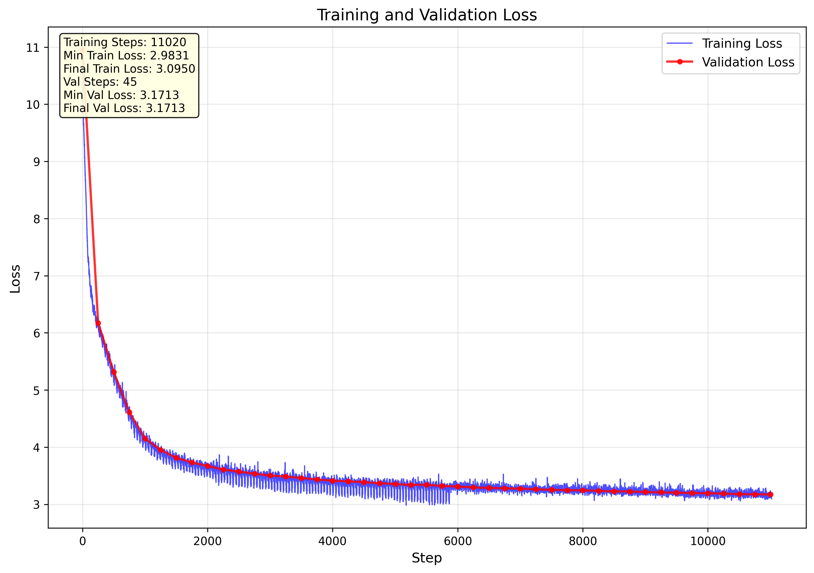

# Reproduce-GPT2-124M From Scratch

[](https://python.org)
[](https://pytorch.org)
[](LICENSE)

🚀 **从零开始复现GPT-2 (124M)模型的完整训练流程**

这个项目实现了完整的GPT-2 124M参数模型的从头训练，包括分布式训练、数据处理、模型评估和可视化等功能。<br>
模型huggingface地址：[GPT2-124M](https://huggingface.co/ShallowU/GPT2-124M)


训练结果(相比目前最新模型，被降维打击😭)
```
Prompt: 'Hello, I'm a computer science student,'
Generated: > Hello, I'm a computer science student,so it's nice to be a computer geek. I'm not a big fan of the computer, so it's not going to be the most powerful and powerful computer in the world. 

```

```
Prompt: 'Hello, I'm a language model,'
Generated: > Hello, I'm a language model,and I'm always looking for people who are comfortable with it. So many of you know the same language on a regular basis, but most of you are not sure whether it is your native language or not. I'll explain that later.
```

## ✨ 项目特色

- 🔥 **完整的GPT-2架构实现** - 从零实现Transformer、注意力机制等核心组件
- ⚡ **高效分布式训练** - 支持多GPU并行训练，优化训练速度
- 📊 **实时监控** - 训练过程可视化，损失曲线自动绘制

## 🏗️ 项目结构

```
Reproduce-GPT2-124M/
|-- pre_tokens
|   handle_tokens.ipynb      # 使用colab预处理10B raw text
|   tranfer-tokens-hf.ipynb  # 将预处理后的tokens存到huaggingface
|-- TestWorkflow
|   train_gpt2_1A6000.py     # 测试下载的模型是否正常工作
|   upload_hf_1A6000.py      # 上传训练结果到Hugging Face
|-- generate.py              # 文本生成脚本
|-- hellaswag.py             # HellaSwag数据集处理脚本(可选，本次训练并没有边训边生成测试)
|-- requirements.txt         # 依赖包列表
├── train_gpt2_8A100.py      # 主训练脚本（支持分布式）
|-- upload_hf_8A100.py       # 上传训练结果到Hugging Face
├── workflow.txt             # 详细的部署流程

```

## 🚀 快速开始

### 1. 环境配置

```bash
# 克隆项目
git clone https://github.com/ShallowU/Reproduce-GPT2-124M.git
cd Reproduce-GPT2-124M

# 安装依赖
# python >= 3.8, torch >= 2.0,cuda >= 11.8
pip install torch torchvision torchaudio --index-url https://download.pytorch.org/whl/cu118
pip install huggingface_hub tiktoken matplotlib numpy transformers
```

### 2. 数据准备

训练时数据集将自动从Hugging Face下载：
```bash
# 数据集信息
HuggingFace Repository: ShallowU/FineWeb-Edu-10B-Tokens-NPY
Size: 10B tokens (教育相关的高质量文本)
Format: NumPy arrays to efficiently load
```

### 3. 开始训练

*设置你的Hugging Face token*
```bash
# 设置Hugging Face token
# 这将允许你上传模型和数据到Hugging Face
# 请在 https://huggingface.co/settings/tokens 创建一个token
# 并将其设置为环境变量
# 替换 "your_token_here" 为你的实际token
export HF_TOKEN="your_token_here" 
```
#### 单GPU训练
```bash
python train_gpt2_8A100.py
```

#### 多GPU分布式训练    
```bash

# 8卡A100训练示例
torchrun --standalone --nproc_per_node=8 train_gpt2_8A100.py
```
具体训练详细一步步流程请参考 [workflow.txt](workflow.txt)

## 📊 训练配置

| 参数 | 值 | 说明 |
|------|-----|------|
| 模型参数 | 124M | GPT-2 Small配置 |
| 批次大小 | 0.5 M tokens | 高效的批次配置 |
| 学习率 | 6e-4 → 6e-5 | 余弦退火调度 |
| 训练步数 | 19,073 | 约10B tokens |
| 预热步数 | 715 | 学习率预热 |
| 序列长度 | 1024 | 标准GPT-2长度 |

## 📈 训练结果

### 性能指标
- **训练时间**: ~1小时 (8x A100 80G), ~16小时 (2x A100 40G)
- **验证损失**: ~3.0 (收敛)
- **吞吐量**: ~150K tokens/sec(8x A100 80G), ~20K tokens/sec(2x A100 40G)


## 🤝 参考资料

- [Andrej Karpathy's nanoGPT](https://github.com/karpathy/nanoGPT)
- [Let's reproduce GPT-2](https://youtu.be/l8pRSuU81PU)
- [GPT-2 Paper](https://cdn.openai.com/better-language-models/language_models_are_unsupervised_multitask_learners.pdf)
- [GPT-3 Paper](https://arxiv.org/abs/2005.14165)

## 📄 许可证

本项目采用 MIT 许可证 - 详见 [LICENSE](LICENSE) 文件

## 🙏 致谢

感谢 Andrej Karpathy!!!

---

⭐ **如果这个项目对您有帮助，请给个Star支持！**