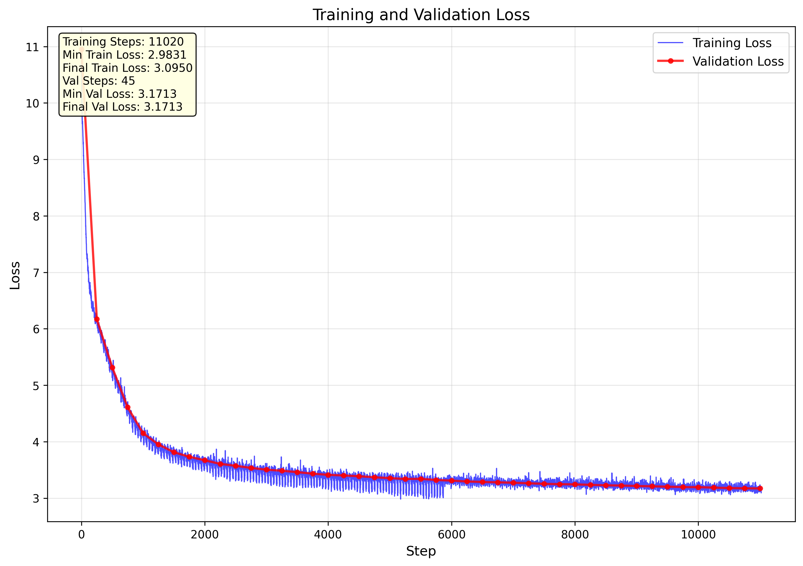

# Reproduce-GPT2-124M From Scratch

[](https://python.org)
[](https://pytorch.org)
[](LICENSE)

[中文](README.md) | [English](README_en.md)
🚀 **Complete training pipeline for reproducing GPT-2 (124M) model from scratch**

This project implements a complete training pipeline for GPT-2 124M parameter model from scratch, including distributed training, data processing, model evaluation, and visualization.<br>
Model on Hugging Face: [GPT2-124M](https://huggingface.co/ShallowU/GPT2-124M)


Training Results (Completely outclassed by current SOTA models 😭)
```
Prompt: 'Hello, I'm a computer science student,'
Generated: > Hello, I'm a computer science student,so it's nice to be a computer geek. I'm not a big fan of the computer, so it's not going to be the most powerful and powerful computer in the world. 

```

```
Prompt: 'Hello, I'm a language model,'
Generated: > Hello, I'm a language model,and I'm always looking for people who are comfortable with it. So many of you know the same language on a regular basis, but most of you are not sure whether it is your native language or not. I'll explain that later.
```

## ✨ Project Features

- 🔥 **Complete GPT-2 Architecture Implementation** - Implementing Transformer, attention mechanisms, and other core components from scratch
- ⚡ **Efficient Distributed Training** - Support for multi-GPU parallel training with optimized training speed
- 📊 **Real-time Monitoring** - Training process visualization with automatic loss curve plotting

## 🏗️ Project Structure

```
Reproduce-GPT2-124M/
|-- pre_tokens
|   handle_tokens.ipynb      # Preprocessing 10B raw text using Colab
|   tranfer-tokens-hf.ipynb  # Uploading preprocessed tokens to Hugging Face
|-- TestWorkflow
|   train_gpt2_1A6000.py     # Testing if downloaded model works properly
|   upload_hf_1A6000.py      # Upload training results to Hugging Face
|-- generate.py              # Text generation script
|-- hellaswag.py             # HellaSwag dataset processing script (optional, not used in this training)
|-- requirements.txt         # Dependencies list
├── train_gpt2_8A100.py      # Main training script (supports distributed training)
|-- upload_hf_8A100.py       # Upload training results to Hugging Face
├── workflow.txt             # Detailed deployment workflow

```

## 🚀 Quick Start

### 1. Environment Setup

```bash
# Clone the project
git clone https://github.com/ShallowU/Reproduce-GPT2-124M.git
cd Reproduce-GPT2-124M

# Install dependencies
# python >= 3.8, torch >= 2.0, cuda >= 11.8
pip install torch torchvision torchaudio --index-url https://download.pytorch.org/whl/cu118
pip install huggingface_hub tiktoken matplotlib numpy transformers
```

### 2. Data Preparation

Dataset will be automatically downloaded from Hugging Face during training:
```bash
# Dataset Information
HuggingFace Repository: ShallowU/FineWeb-Edu-10B-Tokens-NPY
Size: 10B tokens (high-quality educational text)
Format: NumPy arrays for efficient loading
```

### 3. Start Training

*Set your Hugging Face token*
```bash
# Set Hugging Face token
# This allows you to upload models and data to Hugging Face
# Please create a token at https://huggingface.co/settings/tokens
# and set it as an environment variable
# Replace "your_token_here" with your actual token
export HF_TOKEN="your_token_here" 
```

#### Single GPU Training
```bash
python train_gpt2_8A100.py
```

#### Multi-GPU Distributed Training    
```bash
# 8x A100 training example
torchrun --standalone --nproc_per_node=8 train_gpt2_8A100.py
```
For detailed step-by-step training workflow, please refer to [workflow.txt](workflow.txt)

## 📊 Training Configuration

| Parameter | Value | Description |
|-----------|-------|-------------|
| Model Parameters | 124M | GPT-2 Small configuration |
| Batch Size | 0.5M tokens | Efficient batch configuration |
| Learning Rate | 6e-4 → 6e-5 | Cosine annealing schedule |
| Training Steps | 19,073 | ~10B tokens |
| Warmup Steps | 715 | Learning rate warmup |
| Sequence Length | 1024 | Standard GPT-2 length |

## 📈 Training Results

### Performance Metrics
- **Training Time**: ~1 hour (8x A100 80G), ~16 hours (2x A100 40G)
- **Validation Loss**: ~3.0 (converged)
- **Throughput**: ~150K tokens/sec (8x A100 80G), ~20K tokens/sec (2x A100 40G)

## 🤝 References

- [Andrej Karpathy's nanoGPT](https://github.com/karpathy/nanoGPT)
- [Let's reproduce GPT-2](https://youtu.be/l8pRSuU81PU)
- [GPT-2 Paper](https://cdn.openai.com/better-language-models/language_models_are_unsupervised_multitask_learners.pdf)
- [GPT-3 Paper](https://arxiv.org/abs/2005.14165)

## 📄 License

This project is licensed under the MIT License - see the [LICENSE](LICENSE) file for details

## 🙏 Acknowledgments

Thanks to Andrej Karpathy!!!

---

⭐ **If this project helps you, please give it a Star!**